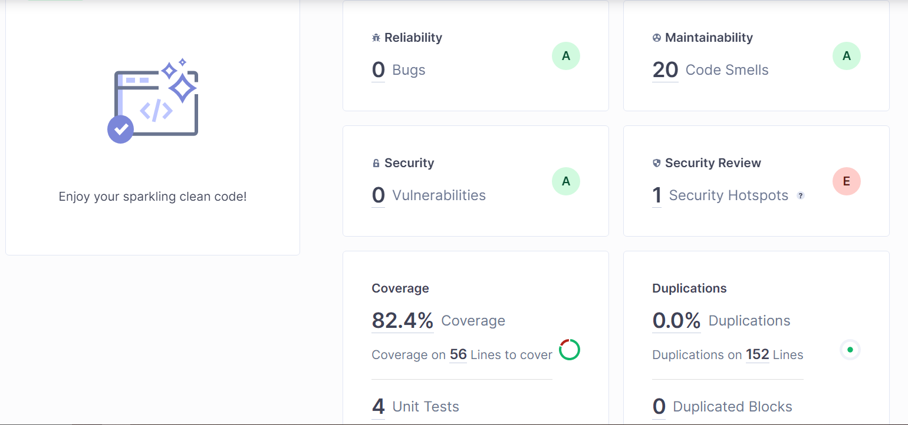
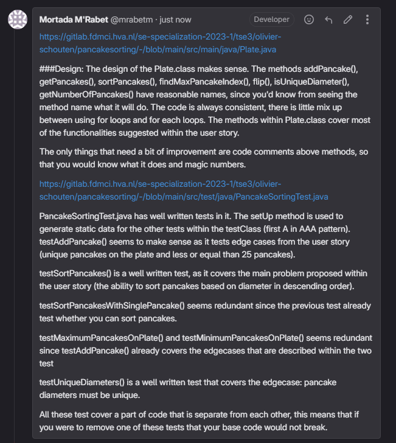

## Student Information

First Name: Mortada 

Last Name: M'Rabet

Student number: 500823653

## Assignment

### 1. Git log

```
Place here the results of the following command: git log --pretty=format:"%hx %ad%x09%s" --date=short`

56ea53dx 2023-09-18     test(Cheftest), refactor(Chef), added 2 tests to test edgecases within Chef, altered bake() method to check orderSize
fe1c868x 2023-09-18     docs(README.md, Chef, Pancake) updated README.md, changed methods name Chef and Pancake
caf5756x 2023-09-18     docs(README.md), chore(), refactor(Pancake, Chef), updated README.md, added a plugin to pom.xml to enable code coverage in sonarqube, changed diameter from double to int datatype
4a5e38ax 2023-09-18     test(ChefTest, PancakeTest), refactor(Chef) Made ChefTests and PancakeTests work. small changes to chef class
4fad3e4x 2023-09-18     docs(Chef, Spatula), refactor(Chef, Spatula, Pancake) added comments to Chef and Spatula classes. Made  variables in Chef, Spatula and Pancake private
aed43d6x 2023-09-18     test(ChefTest), refactor(Chef, Spatula) removed PancakeSorterTest class and moved those tests to Chef test. Added Chef and Spatula class, removed PancakeSorter class and moved methods to Chef and Spatula class
32fd8bbx 2023-09-17     docs, test(ChefTest), refactor(Chef). Update READ.me, added chefCanBakePancakes() and onlySousChefCanFlipPancakes() tests, added Chef class
569e113x 2023-09-17     docs(PancakeSorter) Added comments to pancakeSorter class
9edd2f4x 2023-09-17     test(PancakeSorterTest) Made the pancakeSorterShouldGiveCorrectOutput test work
4e45f70x 2023-09-17     refactor(PancakeSorter) made changes to flipPancakeStack(), sort() and findIndexOfPancakeWithLargestRadius()
faa0038x 2023-09-16     refactor(PancakeSorter) added flip(), changes to sort()
a9ce748x 2023-09-16     test(PancakeTest) Added 1 test to Pancake test which compares the diameter between 2 pancakes
c04afeex 2023-09-15     refactor(Pancake, PancakeSorter) added sort(), getLargestRadius(), compareTo() methods
e471825x 2023-09-15     test(PancakeSorterTest) Added 3 tests to PancakeSorter test along with setup()
6a68919x 2023-09-14     refactor(class) added pancake and pancake sorter classes
2bf316fx 2023-09-12     Initial commit


```


### 2. Sonarqube

A dated screenshot of the overview of the following  quality gates(https://docs.sonarqube.org/latest/user-guide/quality-gates/): Reliability, Security,Maintainability, Coverage and Duplications. Provide a short discussion of the results.



###Reliability A:
The reason why this category has an A is that the code has 0 bugs, 
this means that there are no exceptions when compiling my program.
This also due to TDD, since the process of writing tests first and then coding logic heavily increased the changes of my code being bugfree.

###Maintainability A:
While I might have 20 code smells, all of them are in the pitfall, unused, bad-practice and convention category.
These categories have little effect on maintainability, however fixing the 20 code smells should improve code quality (since it would be more readable) and software quality.

###Security A:
While I did use private attributes for my class variables, 
I can't think of any reason why it would give me an A for security since there is no security in my application

###Security review E:
The reason why this is an E is that within my chef class I used ThreadLocalRandom which is the unsafe version of Random.
This means that if I don't replace ThreadLocalRandom with an alternative that is "thread-safe", my application would be prone to 
race-conditions which is the last thing you want within your application.

###Coverage A:
82.4% Coverage is very decent with 4 unit tests written. 
The reason why this isn't 100% is that I didn't write a test for the Spatula class.

###Duplications A:
The code within the project doesn't have any duplicated lines which is why it is an A.

### 3. Test Driven Development

Your best test class code snippets with a rationale why the unit tests are “good” tests.  Provide a link to the Test class and the class under test in Git.

###ChefTest.java
```java
  @BeforeEach
    void setup(){
            chef1 = new Chef("Gerard",false);
            chef2 = new Chef("Maron",true);

            pancakes = new ArrayList<>();
        pancakes.add(new Pancake(5.0));
        pancakes.add(new Pancake(6.0));
        pancakes.add(new Pancake(10.0));
        pancakes.add(new Pancake(15.0));
        pancakes.add(new Pancake(4.0));
        pancakes.add(new Pancake(3.0));
        }
```        
This is my setup method, which sets up static data for the tests below.
This is the Arrange within the AAA pattern.

```java
@Test
    void pancakeSorterShouldGiveCorrectOutput() throws ChefRoleException {
            assertEquals("[Pancake: 15,0 diameter, " +
            "Pancake: 10,0 diameter, " +
            "Pancake: 6,0 diameter, " +
            "Pancake: 5,0 diameter, " +
            "Pancake: 4,0 diameter, " +
            "Pancake: 3,0 diameter]", chef2.sort(pancakes));
            }
```

I created this test to test the sort method, which sorts pancakes using the pancakeSort method in descending order.
This test is small because it can always run in the development cycle. This test however is not Isolated
since the sort() uses 2 other methods to function properly. However, to resolve this issue a check is done
at the start of the sort method that in case a chef were to sort the pancakes it would throw an exception.
The test is repeatable since the list is always the same and the result is always the same.
The test is self-validating, since running the test gives you the result almost immediately
Lastly the test is Thorough since it covers the previously mentioned edgecase.

```java
@Test
    void onlyChefCanBakePancakes(){
        assertThrows(ChefRoleException.class, () ->{
            chef2.bake(1);
        });
    }
```
I created this test to test an edgecase in which a SousChef is not allowed to bake pancakes.
This test adheres to the AAA pattern in which the first A is arranged in setup(), the other two A'S
are chef2.bake and assertThrows which expects an error.

It's a small (fast), isolated (since it only covers 1 edgecase and does not rely on any other method),
repeatable (since it does not change depending on value), self-validating (since a result is expected)
and thorough (since this test covers an edge case).

```java
    @Test
    void bakingProcessShouldGoCorrectly() throws ChefRoleException {
        pancakes = chef1.bake();
        assertTrue(arePancakeUnique(pancakes), "Pancakes are unique");
```
```java
@Test
    void cannotBakeLessThan1Pancake() {
        assertThrows(IllegalArgumentException.class, () ->{
            chef2.bake(0);
        });
    }
```
```java
@Test
    void cannotBakeMoreThan25Pancakes(){
        assertThrows(IllegalArgumentException.class, () ->{
            chef2.bake(26);
        });
    }
```

I created these tests to test the following edgecases:
- in which a Chef is not allowed to bake less than 1 pancakes.
- in which a Chef is not allowed to bake more than 25 pancakes.

These tests adhere to the AAA pattern in which the first A is arranged in setup(), the other two A'S
are chef2.bake and assertThrows which expects an error.

It's a small (fast), isolated (since it only covers 1 edgecase and does not rely on any other method),
repeatable (since it does not change depending on value), self-validating (since a result is expected)
and thorough (since this test covers an edge case).

https://gitlab.fdmci.hva.nl/se-specialization-2023-1/tse3/mortada-mrabet/pancake-testing/-/blob/main/src/main/java/Chef.java?ref_type=heads

https://gitlab.fdmci.hva.nl/se-specialization-2023-1/tse3/mortada-mrabet/pancake-testing/-/blob/main/src/test/java/ChefTest.java?ref_type=heads

### 4. Code Reviews

Screenshots of the code reviews you have performed on code of another student as comments in Gitlab: Provide a link to the comments in Gitlab.



https://gitlab.fdmci.hva.nl/se-specialization-2023-1/tse3/olivier-schouten/pancakesorting/-/blob/main/src/main/java/Plate.java

https://gitlab.fdmci.hva.nl/se-specialization-2023-1/tse3/olivier-schouten/pancakesorting/-/blob/main/src/test/java/PancakeSortingTest.java